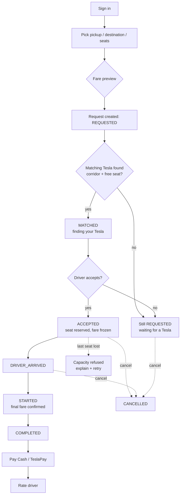
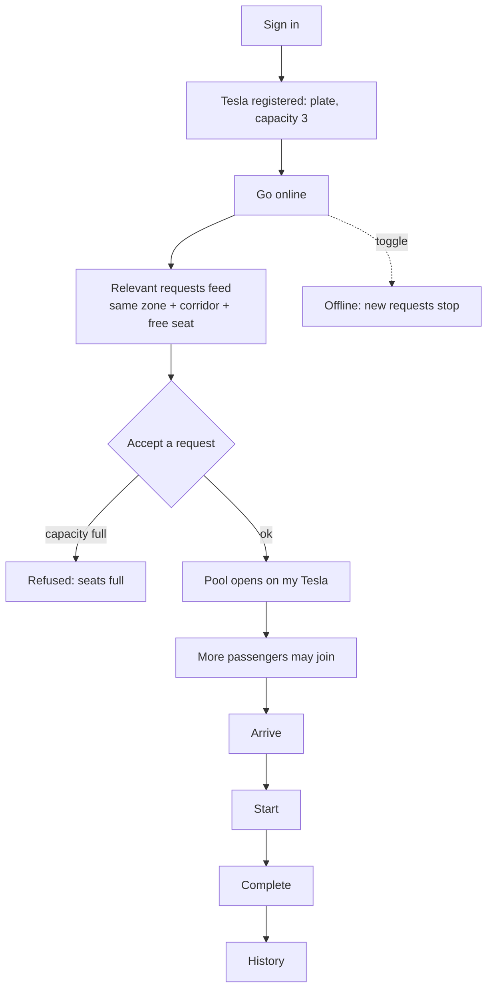

# Product Requirements Document
## Dhaka Tesla Pool — Ride-Pooling MVP

**Version:** 1.0.0-draft
**Status:** Product baseline. Technical detail is owned by `SRS_Dhaka_Tesla_Pool (1).md`; this document does not repeat it.
**Sources:** *Dhaka Tesla Pool* challenge brief (RoBenDevs) §1–19; SRS v1.0.0-draft §1–11
**Audience:** evaluators and interview panel — read this to understand the product and the reasoning; read the SRS to verify how it is built.

---

## 1. Overview

### 1.1 Tagline
**Share a seat. Split the fare. Survive Dhaka traffic.**

### 1.2 Problem statement
8:41 AM, Banani Road 11. Jashim is leaning against Bullet, his three-seat, battery-powered "Tesla". Nusrat is already late and books a ride to Mohakhali. Two minutes later a stranger, Rafiq, books almost the same route to Gulshan 1. Thirty seconds after that Shirin tries to grab the last seat.

The product has to decide, in about a second, whether these riders can share a Tesla, split the fare fairly, and survive a ten-minute ride without anyone getting their own fare, status, or identity mixed up. Jashim only wants to know who is riding and when he can go. Everyone else just wants to arrive, pay a fair price, and not accidentally make a new friend.

### 1.3 Why pooling is the shape of the problem
A single occupant on a three-seat vehicle is the expensive case: the driver burns the same fuel and burns the same ten minutes of Dhaka traffic for a third of the revenue. Pooling is not a nice-to-have feature here, it is the unit economics. The whole product therefore optimises for one question — **can this next request share this specific Tesla right now?** — rather than for routing cleverness.

### 1.4 Goals
| # | Goal |
|---|---|
| G1 | A passenger can request a multi-seat ride, see an exact fare before committing, and track it to completion. |
| G2 | A driver can go online, see only requests that genuinely fit their Tesla, and run the trip through one clear lifecycle. |
| G3 | Two or more requests share one Tesla whenever a documented, deterministic rule says they may. |
| G4 | Seat capacity is never exceeded — including when two passengers race for the last seat. |
| G5 | Every state change is reconstructable afterwards: who, when, route, fare, why. |
| G6 | A passenger never sees another passenger's fare or status, even inside the same pool. |

### 1.5 Non-goals
Real map/routing integration, real payment gateways, microservices, Kafka, Kubernetes, Redis, message queues, and any screen or feature not traceable to a requirement. (SRS §1.2, §11; brief §16.)

---

## 2. Personas

The story cast is used consistently in seed data, tests, README, and this document — never `user1`/`driver1` placeholders (brief §12, §16).

| Persona | Context and goal | Friction today | "The day went well" looks like |
|---|---|---|---|
| **Jashim** — driver of **Bullet**, a three-seat Tesla | Fill the third seat on trips he is making anyway; leave on time | Empty legs, no visibility of who is riding, no way to know when he is clear to go | 3/3 seats occupied, a manifest showing exactly who is aboard, and an unambiguous "you can go now" |
| **Nusrat** — passenger, Banani → Mohakhali, already late | Certainty of a seat and a known price, fast | Fixed fares, no seat guarantee, no ETA signal | Seat held at request time, exact fare shown before she pays, live status |
| **Rafiq** — passenger, Banani → Gulshan 1, willing to share | A cheap ride without a private-car premium | No rule explaining when sharing is allowed, fear of fare changes at pickup | Fare locked when he joins; clear statement that he is sharing with one other rider |
| **Shirin** — passenger, grabbing the last seat 30 s late | Either a seat now, or an honest answer immediately | Losing the race with a spinner and no explanation | A confirmed seat, **or** an instant, specific "last seat just taken" message with an obvious retry |

Shirin is the product's stress test: she is the only persona whose happy path can legitimately fail, and the failure must be as usable as the success.

---

## 3. User journeys

### 3.1 Passenger — happy path (Nusrat)
1. Signs up / signs in as a passenger.
2. Requests a ride: pickup zone, destination zone, seats.
3. Receives an **estimated fare immediately**, before committing.
4. Status becomes `MATCHED` (a suitable Tesla exists with a free seat) — she sees "finding your Tesla".
5. A driver accepts; status becomes `ACCEPTED`; her fare is frozen.
6. Other passengers join the same Tesla; her fare is not repriced behind her back.
7. `DRIVER_ARRIVED` → `STARTED` → `COMPLETED`; at `STARTED` the final fare (with pool discount) is confirmed.
8. Pays by Cash or TeslaPay, optionally rates the driver, sees the ride in her history.

### 3.2 Driver — happy path (Jashim)
1. Signs in; his Tesla (plate, fixed capacity 3) is registered once.
2. Goes **online**.
3. Sees only *relevant* requests: same pickup zone, compatible destination corridor, and free capacity on Bullet.
4. Accepts one request → his Tesla's pool opens; he also sees other matchable requests for the same route.
5. Passengers may join the open pool (matching rule + free seats).
6. `DRIVER_ARRIVED` → `STARTED` → `COMPLETED`, with the manifest (who, how many seats, pool total) visible throughout.
7. Reviews ride history; goes offline.

### 3.3 The pooled ride (Bullet, three seats)
Nusrat (Banani → Mohakhali) and Rafiq (Banani → Gulshan 1) are overlapping but not identical trips; they share. Shirin (Banani → Dhanmondi) arrives 30 seconds later and takes the third seat. Three individual fares, one trip, no capacity breach.

### 3.4 Edge-case journeys
| # | Situation | Required product behaviour |
|---|---|---|
| E1 | **Last seat lost mid-request** (Shirin vs a rival claim) | Immediate, specific 409-style rejection naming the reason; the request stays editable/cancellable; a one-tap retry that re-runs matching |
| E2 | Driver goes offline with an already-assigned passenger | Assignment is not silently dropped: the ride stays `ACCEPTED`, the passenger is told the driver is reconnecting, and the driver sees the ride still owed to them when they return |
| E3 | Passenger cancels after assignment | Seat returns to the pool; pool total recalculates; remaining members' fares recompute at `STARTED`; status history records the cancellation |
| E4 | Driver cancels / no-shows before arrival | Ride returns to `REQUESTED`-equivalent visibility for re-matching, passenger is notified, history records the reason |
| E5 | TeslaPay balance too low | Rejection is explicit and names the shortfall; Cash remains selectable as the fallback |
| E6 | Passenger requests more seats than any Tesla can offer | Rejected at request time with the maximum available stated |
| E7 | Two identical requests from the same passenger | Prevented at request time (no double booking of yourself) |

---

## 4. Feature requirements — user stories

Acceptance criteria are Given/When/Then and are hand-verifiable. `Traces:` cites the SRS requirement each story satisfies.

### 4.1 Passenger
| ID | User story | Acceptance criteria | Traces |
|---|---|---|---|
| **US-P1** | As a passenger I can sign up and sign in so my rides are mine | **G** no account **W** valid details **T** an account exists and I am signed in; **G** signed in **W** bad password **T** sign-in is refused with a clear message | FR-P1, FR-D1 |
| **US-P2** | As a passenger I can request a ride with pickup, destination, and seats | **G** signed in **W** pickup, destination, 1..capacity seats **T** the request is created in `REQUESTED`; **G** any state **W** an invalid zone or seat count **T** rejected server-side before anything is created | FR-P2, NFR-3 |
| **US-P3** | As a passenger I see an estimated fare at request time | **G** a valid request **W** I submit it **T** an estimate is returned before confirmation and matches the published fare formula for that zone pair | FR-P3, FR-F1, FR-F2 |
| **US-P4** | As a passenger I can track my own ride's status | **G** I have an active ride **W** I open it **T** the current state is shown with a plain-language label; **G** I am not the owner **W** I request someone else's ride **T** refused | FR-P4, FR-P7, NFR-1 |
| **US-P5** | As a passenger I can see my own ride history | **G** I have past rides **W** I open history **T** I see route, times, final fare, and status sequence — and only my rides | FR-P5, FR-R5, NFR-4 |
| **US-P6** | As a passenger I can cancel while the ride is cancellable | **G** `REQUESTED`/`MATCHED`/`ACCEPTED`/`DRIVER_ARRIVED` **W** I cancel **T** status becomes `CANCELLED`, the seat returns to the pool, history records it; **G** `STARTED` **W** I cancel **T** refused with an explanation | FR-P6, FR-R5 |
| **US-P7** | As a passenger I see only my own fare and status, even inside a shared pool | **G** sharing a Tesla with Rafiq **W** I load any pool or ride view **T** only my fare and status appear | FR-P7, NFR-1 |

### 4.2 Driver / Tesla
| ID | User story | Acceptance criteria | Traces |
|---|---|---|---|
| **US-D1** | As a driver I can sign in and toggle online/offline | **G** signed in **W** I toggle **T** availability flips and is reflected immediately; going offline stops new matchable requests being shown | FR-D1 |
| **US-D2** | As a driver I own exactly one Tesla with a fixed capacity set at registration | **G** registering **W** I provide plate and capacity **T** the Tesla is created once; **G** already owning one **W** registering again **T** refused | FR-D2 |
| **US-D3** | As a driver I only see requests that genuinely fit my Tesla | **G** online **W** I open the feed **T** every listed request matches pickup zone and corridor and has free capacity; non-matching requests are absent | FR-D3, FR-M2, FR-M3 |
| **US-D4** | As a driver I can accept a ride or a poolable ride | **G** a matching request **W** I accept **T** it joins my Tesla's pool, status becomes `ACCEPTED`, seats are reserved; **G** the last seat **W** two accepts race **T** exactly one succeeds, the other is refused, capacity is never exceeded | FR-D4, FR-R1, FR-R2, FR-C1 |
| **US-D5** | As a driver I can mark arrived, start, and complete | **G** `ACCEPTED` **W** arrived → start → complete **T** each transition is accepted and timestamped; **G** any state **W** an out-of-order action **T** refused | FR-D5, FR-R4, NFR-3 |
| **US-D6** | As a driver I can see who is assigned to my active ride and my history | **G** an active ride **W** I open the manifest **T** passenger names, seats, and pool total are shown; **G** past rides **W** I open history **T** I see my completed trips | FR-D6, FR-R5 |

### 4.3 Ride / Pool
| ID | User story | Acceptance criteria | Traces |
|---|---|---|---|
| **US-R1** | Multiple requests may share one Tesla when the matching rule is satisfied | **G** Nusrat and Rafiq **W** both requests exist for compatible routes **T** they occupy one Tesla; **G** incompatible destinations **W** both requests exist **T** they are not offered to the same Tesla | FR-R1, FR-M2 |
| **US-R2** | Occupied seats never exceed capacity, even under concurrent claims | **G** Bullet has 1 seat left **W** two claims arrive simultaneously **T** one succeeds and one is refused; occupied ≤ capacity at every observation | FR-R2, FR-C1, NFR-2 |
| **US-R3** | Each passenger in a pool receives an individually calculated fare | **G** a pool of three **W** it completes **T** each passenger has their own fare computed from their own trip distance | FR-R3, FR-F1 |
| **US-R4** | The pool lifecycle is explicit and pool membership is unambiguous | **G** an active ride **W** I inspect it **T** each member appears exactly once, and every state change is visible in the timeline | FR-R4, FR-R5, NFR-4 |
| **US-R5** | Afterwards, the system can explain exactly what happened | **G** any completed or cancelled ride **W** I read its history **T** who, when, route, fare, and each status change with timestamps are recoverable | FR-R5, NFR-4 |

### 4.4 Fare & payment
| ID | User story | Acceptance criteria | Traces |
|---|---|---|---|
| **US-F1** | I can verify any fare by hand from published numbers | **G** Nusrat's trip **W** I apply base + per-km − discount **T** the computed value equals the stored value exactly | FR-F1, FR-F2, NFR-6 |
| **US-F2** | I can settle by Cash or simulated TeslaPay | **G** a completed ride **W** I choose a method **T** the payment is recorded with amount in integer poysha; insufficient TeslaPay balance is refused with the shortfall | FR-F3 |
| **US-F3** | My fare is never repriced behind my back | **G** assigned, then another passenger joins **W** I am already aboard **T** my fare changes only at `STARTED`, is shown to me, and the change is in my history | FR-R3, FR-R5, NFR-4 |

### 4.5 Trust, history & demo
| ID | User story | Acceptance criteria | Traces |
|---|---|---|---|
| **US-T1** | As a passenger I can rate the driver after a completed ride | **G** a completed ride **W** I submit 1–5 **T** it is recorded once and shown on the driver's profile | Rating (optional per SRS §4.3) |
| **US-T2** | A reviewer can reproduce the whole story from seed data | **G** a fresh install **W** migrations + seed run **T** the cast (Jashim/Bullet, Nusrat, Rafiq, Shirin) exists with demo credentials and a workable pooled scenario | FR-D6, brief §6/§12 |
| **US-T3** | Nothing I cannot explain ships | **G** any code path **W** I am asked about it **T** the design decision, trade-off, and failure mode are documented | SRS §7.6, §7.8, brief §8 |

---

## 5. UX — screens and flows

### 5.1 Screen inventory
| # | Screen | Purpose | Must handle | Traces |
|---|---|---|---|---|
| P1 | Sign in / Sign up | Entry, role selection (passenger/driver) | validation errors, duplicate email | FR-P1 |
| P2 | Request ride | Zone pickers, seat stepper, **live fare preview** | invalid zones, no capacity anywhere, loading | FR-P2, FR-P3 |
| P3 | Ride status tracker | Current state with plain-language label + timeline | `MATCHED` waiting, capacity-lost, cancelled, driver offline | FR-P4, FR-R5 |
| P4 | My rides (history) | Past trips with final fare and status sequence | empty state | FR-P5 |
| P5 | Payment & wallet | Cash / TeslaPay, balance, shortfall message | insufficient balance | FR-F3 |
| P6 | Rate driver | 1–5 after completion | already rated | Rating |
| D1 | Sign in | Driver entry | validation errors | FR-D1 |
| D2 | Availability toggle | Online/offline, one Tesla summary | offline while owing a ride (E2) | FR-D1, FR-D6 |
| D3 | Relevant requests | Matchable feed with pickup/destination/seats/estimate | empty ("no matching requests right now"), loading | FR-D3 |
| D4 | Ride manifest | Who is aboard, seats used vs capacity, pool total | no passengers yet | FR-D6, FR-R4 |
| D5 | Trip controls | Arrive / Start / Complete, enabled only when legal | illegal transition feedback | FR-D5, NFR-3 |
| D6 | Ride history | Completed trips | empty state | FR-D6 |

### 5.2 Passenger flow

### 5.3 Driver flow

### 5.4 The last-seat race (Nusrat vs Shirin)
```mermaid
sequenceDiagram
    participant N as Nusrat
    participant S as Shirin
    participant API as API
    participant DB as PostgreSQL
    N->>API: claim seat on Bullet (2 already taken)
    S->>API: claim seat on Bullet (2 already taken)
    API->>DB: BEGIN; SELECT pool FOR UPDATE
    API->>DB: BEGIN; SELECT pool FOR UPDATE (waits)
    DB-->>API: occupied=2, capacity=3
    API->>DB: membership + occupied=3 + history
    API-->>N: 201 ACCEPTED (seat held)
    DB-->>API: lock released
    API->>DB: re-check: occupied=3, capacity=3
    API-->>S: 409 last seat taken (retry offered)
```

### 5.5 Key screen wireframes
**P2 — Request ride (live fare preview)**
```
┌──────────────────────────────────────────────┐
│ Request a ride                               │
│ Pickup        [ Banani            ▾ ]        │
│ Destination   [ Mohakhali         ▾ ]        │
│ Seats         [ 1 ] [2] [3]                  │
│ ──────────────────────────────────────────── │
│ Estimated fare                               │
│   base            ৳300.00                   │
│   distance 3.8km ৳57.00                    │
│   estimate       ৳357.00                    │
│   "20% sharing discount applies at start"    │
│ [ Request ride ]                             │
└──────────────────────────────────────────────┘
```
**P3 — Ride status tracker**
```
┌──────────────────────────────────────────────┐
│ Banani → Mohakhali          REQUESTED→…      │
│ ● Requested ─ ○ Matched ─ ○ Accepted ─ ○ …   │
│ Matching you with an online Tesla…           │
│ ──────────────────────────────────────────── │
│ Timeline                                     │
│  09:12  Requested (Banani → Mohakhali, 1 seat)│
│  09:13  Matched — Tesla with free seat found  │
│ ──────────────────────────────────────────── │
│ [ Cancel ride ]                              │
└──────────────────────────────────────────────┘
```
**D4 — Driver manifest (Bullet, 3 seats)**
```
┌──────────────────────────────────────────────┐
│ Bullet · DHAKA-TAXI-01                       │
│ Seats  3 / 3 filled           [2 open][1 open]│
│ ──────────────────────────────────────────── │
│ Nusrat   1 seat   Banani → Mohakhali          │
│ Rafiq    1 seat   Banani → Gulshan 1         │
│ Shirin   1 seat   Banani → Dhanmondi         │
│ ──────────────────────────────────────────── │
│ Pool total ৳1,033.20     [ Arrive ] [ Start ] │
└──────────────────────────────────────────────┘
```
### 5.6 Messaging rules
Every screen must define **loading**, **error**, **empty**, and (where relevant) **capacity-full** copy. A lost seat race is never a spinner or a generic failure: it names the cause and offers retry (E1). Illegal lifecycle actions explain which state blocked them.

---

## 6. Business rules (plain language)

The technical formulation of these rules, with the reasoning and rejected alternatives, lives in `docs/decisions.md`. The numbers below are the contract; implementation must match them exactly.

### 6.1 Matching rule
**Two requests may share one Tesla if and only if their pickup zones are identical AND their destination corridors overlap** (share at least one zone).

| Corridor | Zones |
|---|---|
| `banani_gulshan` | Banani, Gulshan 1, Mohakhali |
| `dhanmondi_farmgate` | Dhanmondi, Farmgate, Mohakhali |
| `mirpur_uttara` | Mirpur, Uttara |
| `bashundhara_east` | Bashundhara, Dhanmondi, Farmgate |

Worked examples:

| Pair | Same pickup? | Corridors overlap? | Share? |
|---|---|---|---|
| Nusrat Banani → Mohakhali & Rafiq Banani → Gulshan 1 | yes | both `banani_gulshan` | **Yes** |
| + Shirin Banani → Dhanmondi | yes | `banani_gulshan` ∩ `dhanmondi_farmgate` = {Mohakhali} | **Yes** |
| Banani → Mirpur & Banani → Bashundhara | yes | `mirpur_uttara` vs `bashundhara_east` = ∅ | **No** |

This is the whole rule. It is deterministic, needs no map API, and an evaluator can apply it by hand in seconds (SRS FR-M1/M2/M3).

### 6.2 Fare rule
Distance is measured on a published zone grid in whole kilometres (each zone has published coordinates). Money is stored as **integer poysha** — 1 Taka = 100 poysha — never as a decimal or float, because rounding on floats makes hand-verification and reconciliation unreliable.

```
distanceKm      = |x₁ − x₂| + |y₁ − y₂|          (Manhattan distance on the zone grid)
distanceCharge  = 1500 poysha × distanceKm        (৳15.00 per km, rounded to whole poysha)
passengerFare   = 30000 + distanceCharge − poolDiscount
poolDiscount    = 20% of distanceCharge when the Tesla carries ≥ 2 passengers, otherwise 0
```

Worked fares for the Bullet scenario (verifiable with a calculator):

| Passenger | Trip | Distance | base + distance | Discount | **Final fare** |
|---|---|---|---|---|---|
| Nusrat | Banani → Mohakhali | 3.8 km | ৳357.00 | −৳11.40 | **৳345.60** = 34560 poysha |
| Rafiq | Banani → Gulshan 1 | 2.0 km | ৳330.00 | −৳6.00 | **৳324.00** = 32400 poysha |
| Shirin | Banani → Dhanmondi | 5.3 km | ৳379.50 | −৳15.90 | **৳363.60** = 36360 poysha |

**When the fare is decided (important).** A request is estimated at creation (US-P3), but the sharing discount cannot be known until occupancy is final:
1. **At assignment** (`ACCEPTED`): the fare is frozen as base + distance, with no discount yet.
2. **At `STARTED`** (occupancy final): if the Tesla carries ≥ 2 passengers, every member's fare is recomputed with the 20% discount and shown to them; a solo ride keeps the full fare.

Recomputing once, at one point, for everyone, is why a passenger is never repriced behind their back (US-F3), and the change is recorded in the status history.

No traffic, weather, or vehicle-type factors are applied at MVP. The brief permits them only if the result stays hand-testable, and every extra factor makes the fare one more thing to explain and one more thing to get wrong — so they are documented as deliberately omitted (SRS FR-F4).

### 6.3 Capacity rule
A Tesla's capacity is fixed at registration and is a hard ceiling. When two claims race for the last seat, exactly one succeeds and the other is refused immediately with a specific reason. Occupied seats never exceed capacity under any concurrency (SRS FR-R2, FR-C1, NFR-2).

This ceiling is not merely checked in application code — the database itself refuses to record more occupied seats than the Tesla's capacity, so a future code path that forgets the check still cannot overbook. Every table, relationship, and constraint in the schema is documented and must be explainable on demand (SRS FR-DB1).

### 6.4 Cancellation rule
`CANCELLED` is allowed from `REQUESTED`, `MATCHED`, `ACCEPTED`, and `DRIVER_ARRIVED`. It is **not** allowed from `STARTED` — once the trip is under way the passenger has been picked up. On cancellation the seat returns to the pool and the pool total is recomputed; the cancellation is permanent and recorded.

### 6.5 Privacy rule
A passenger sees only their own fare and status. Inside a shared pool, the driver sees passenger names, seats, and the pool total; individual passenger fares are never exposed to another passenger (SRS FR-P7, NFR-1).

### 6.6 Payment rule
Cash or simulated TeslaPay wallet only. No real gateway. A TeslaPay payment is refused if the balance is short, and the shortfall is stated (brief §5; SRS FR-F3).

---

## 7. Success metrics and MVP acceptance

### 7.1 Product metrics (observed during the demo/seed scenario, and the basis for the scale reasoning in SRS §7.8)
| Metric | Target | Why it matters |
|---|---|---|
| Pooling rate | ≥ 2 of 3 seeded passengers share a Tesla | The core value proposition actually happens |
| Fill factor at match | Bullet reaches 3/3 seats in the demo scenario | Driver economics |
| Time to match | < 60 s from request to `MATCHED` | "in about a second" in the brief refers to the decision, not the wait |
| Capacity violations | **0** | Hard correctness (NFR-2) |
| Cross-account data leaks | **0** | Hard correctness (NFR-1) |
| Invalid state transitions accepted | **0** | Lifecycle integrity (NFR-3) |
| Completion rate / cancellation rate | Tracked, no target at MVP | Baseline for later tuning |

### 7.2 MVP acceptance criteria
The MVP is accepted when all six required behaviours (SRS §7.3) are demonstrated and green as tests, and the seeded story runs end to end:
1. Tesla/Bullet capacity can never be exceeded, including two concurrent claims for the last seat.
2. Invalid state transitions are rejected.
3. Nusrat's and Rafiq's pooled fares calculate to **34560** and **32400** poysha exactly as in §6.2 (and Shirin's to **36360**).
4. A user cannot read or modify another user's ride.
5. Cancellation rules hold per state, and a cancelled seat returns to the pool.
6. Two concurrent seat claims cannot corrupt pool capacity.

Two delivery conditions gate acceptance alongside the behaviours above:
7. **Portability** — the full system (frontend, backend, database) comes up from a single documented Docker Compose command on a machine that only has Docker (SRS NFR-5).
8. **Deployability** — a public deployment on free-tier hosting where available, otherwise a documented, reproducible Docker deployment path (SRS NFR-8).

---

## 8. Risks and mitigations
| Risk | Impact | Mitigation |
|---|---|---|
| Matching rule produces false positives (riders whose routes genuinely conflict) | Bad rides, refund churn | Rule is deterministic and corridor-bounded; negative cases are unit-tested; rule is one constant change, not scattered logic |
| Overbooking the last seat under concurrency | Severe trust failure; seat physically unavailable | Seat claim is a single serialised transaction; the database itself refuses to hold more occupied seats than capacity; race is a required test |
| Stale driver availability (driver goes offline mid-ride) | Passenger stranded without explanation | Assignment survives going offline; passenger is notified; driver sees owed rides on return (E2) |
| Fare disputes ("it changed when I got in") | Erosion of the fairness promise | Fare frozen at assignment, recomputed once at `STARTED`, change shown and logged (US-F3) |
| Fake payment erodes trust | Cash-only fallback feels unpolished | TeslaPay is explicitly labelled simulated; cash always available; shortfall stated |
| Scope creep into maps, microservices, queues | Loses the "small clean MVP with good process" scoring advantage | Explicit non-goals (§1.5); every feature must trace to a story and an SRS ID |
| AI-written code that cannot be explained live | Fails the ownership criterion | AI usage disclosed with accepted/rejected examples; every non-mandated choice justified; nothing ships that the team cannot debug |

---

## 9. Scope boundaries, assumptions, and open questions

### 9.1 In scope
Passenger ride request, fare estimate, status tracking, history, cancellation; driver online/offline, vehicle capacity, relevant requests, ride lifecycle actions; pooling up to the Tesla's capacity with individual fares and clear membership; simulated wallet payment; driver rating; Docker-based, reproducible deployment.

### 9.2 Out of scope
Real map/routing (Google Maps or equivalent), real payment gateways, microservices, Kafka, Kubernetes, Redis, message queues, native mobile apps, admin tooling beyond the brief.

### 9.3 Assumption register (SRS §2.4, brief §17)
| # | Assumption | Why | If it breaks |
|---|---|---|---|
| A1 | Geography is a predefined zone list with a published corridor grouping | The brief forbids fighting map APIs; a list keeps matching and fare hand-testable | Swap in a real geo index later; rule and fare read zone data only |
| A2 | A passenger may join an open, matchable pool without per-join driver approval | The driver already consented by going online and the rule is deterministic; an approval step per join would add friction for no safety gain at MVP | Introduce per-join approval if trust data or complaint rates justify it |
| A3 | Status updates are polled rather than pushed | Keeps the MVP free of extra infrastructure (NFR-7) | Add a push channel (SSE/WebSocket) when wait times make polling visibly janky |
| A4 | Fares are recomputed once at `STARTED` rather than repriced on every join | One deterministic point, symmetric across passengers, fully auditable | Per-join repricing only if the pricing model becomes dynamic |
| A5 | Zone distances come from a published coordinate grid, not real road distance | Real routing is out of scope; the grid keeps fares computable by hand | Replace the distance function with a routing provider without touching the fare structure |
| A6 | The dashboard's route map is an illustration, not a map | There is no geospatial data in the product (A1, and §9.2 puts real mapping out of scope), so the grid, radar sweep and moving vehicles are decorative. The panel labels itself "illustrative, not live tracking" and shows no location, driver or telemetry | A real map needs a routing/geo provider and a location feed; only then can the panel stop saying so |
| A7 | The fare shown on the dashboard is always the server's quote, never computed in the browser | One implementation of the fare rule avoids two disagreeing by a paisa, with the browser's copy being the one on screen (D29) | Nothing to break: if pricing becomes dynamic, both screens already read the same endpoint |
| A8 | Driver, ETA, fleet-count and vehicle-charge figures are shown as unavailable until Phase 4 | `Ride` carries no driver until an assignment exists, so any value shown would be invented on a screen reached by signing in (D29) | Phase 4's assignment records make these real; the components already read from a single `Ride` prop |

### 9.4 Open questions
| Question | Current answer for the MVP |
|---|---|
| Who pays for the driver's time — per passenger or per pool? | Per passenger; the driver sees the pool total (product decision, not in the brief) |
| Should a driver be able to remove a passenger they dislike? | Not at MVP; removal is a support-level action, not a product feature |
| What happens to a rider if a driver's Tesla breaks down mid-trip? | Out of scope; recorded as a known limitation, not a designed feature |

---

## 10. Traceability matrix
One row per user story: which SRS requirement it satisfies, which screen proves it, which test proves it, and which seeded data exercises it.

| Story | SRS | Screen | Test | Seed data |
|---|---|---|---|---|
| US-P1 sign in/up | FR-P1 | P1, D1 | auth e2e | Jashim, Nusrat, Rafiq, Shirin |
| US-P2 request ride | FR-P2, NFR-3 | P2 | ride-request e2e | Nusrat's request |
| US-P3 fare estimate | FR-P3, FR-F1/2 | P2 | fare unit + e2e | zone grid |
| US-P4 status tracking | FR-P4, FR-P7 | P3 | lifecycle e2e | active ride |
| US-P5 history | FR-P5, FR-R5 | P4 | history e2e | completed ride |
| US-P6 cancellation | FR-P6 | P3 | cancellation e2e | cancellable + started rides |
| US-P7 own fare only | FR-P7, NFR-1 | P3, P5 | isolation e2e | Nusrat + Rafiq sharing |
| US-D1 availability | FR-D1 | D2 | driver e2e | Jashim online/offline |
| US-D2 one Tesla | FR-D2 | D2 | driver e2e | Bullet (capacity 3) |
| US-D3 relevant requests | FR-D3, FR-M2/3 | D3 | matching unit + e2e | Bullet feed |
| US-D4 accept ride/pool | FR-D4, FR-R1/2, FR-C1 | D4 | pooling e2e | Bullet pool |
| US-D5 arrive/start/complete | FR-D5, NFR-3 | D5 | lifecycle e2e | active ride |
| US-D6 manifest + history | FR-D6 | D4, D6 | driver e2e | Bullet manifest |
| US-R1 share a Tesla | FR-R1 | D3, D4 | matching unit | Nusrat + Rafiq |
| US-R2 capacity never exceeded | FR-R2, FR-C1, NFR-2 | D4 | concurrency e2e | Bullet, last seat |
| US-R3 individual fare | FR-R3 | D4 | fare unit + e2e | 3-member pool |
| US-R4 explicit lifecycle | FR-R4, NFR-4 | P3, D5 | state-machine unit | status history |
| US-R5 reconstruct history | FR-R5, NFR-4 | P4 | history e2e | completed + cancelled rides |
| US-F1 hand-checkable fare | FR-F1, NFR-6 | P2 | fare unit | 34560 / 32400 |
| US-F2 cash / TeslaPay | FR-F3 | P5 | payment e2e | wallet balances |
| US-F3 no surprise repricing | FR-R3, FR-R5 | P3 | fare-at-start e2e | 3-member pool |
| US-T1 rating | Rating (optional) | P6 | rating e2e | completed ride |
| US-T2 reproducible story | FR-D6, brief §6/§12 | — | seed e2e | cast + demo scenario |
| US-T3 explainability | SRS §7.6/§7.8 | — | review | docs/ |

---

## 11. Appendix

### 11.1 Glossary
| Term | Meaning |
|---|---|
| Tesla | The driver's vehicle (colloquial name from the brief; not the car brand) |
| Pool | A ride shared by two or more passengers in one Tesla |
| Poysha / Paisa | Smallest BDT subunit; 1 Taka = 100 poysha |
| TeslaPay | Simulated in-app wallet payment method; no real gateway |
| Corridor | A named group of Dhaka zones used by the matching rule (§6.1) |
| Matching rule | The deterministic test that decides whether two requests may share one Tesla (§6.1) |
| `MATCHED` | A suitable online Tesla with free capacity has been identified for the request; the driver has not yet accepted |
| `ACCEPTED` | A driver has committed to the request and the seat is reserved |
| `STARTED` | The trip is under way; occupancy is final and fares are recomputed with any sharing discount |

### 11.2 Related documents
- `SRS_Dhaka_Tesla_Pool (1).md` — technical requirements, ERD, and non-functional requirements
- `docs/architecture.md` — architecture diagram, ERD, lifecycle diagram
- `docs/decisions.md` — matching rule, fare model, concurrency mechanism, trade-offs
- `docs/scaling-bonus.md` — reasoning for 1M passengers / 100k drivers (SRS §7.8)
- `README.md` — setup, demo credentials, API overview, AI usage disclosure

### 11.3 Revision history
| Version | Date | Change | Author |
|---|---|---|---|
| 1.0.0-draft | — | Initial PRD derived from the Dhaka Tesla Pool brief and SRS v1.0.0-draft | Team |