# Project Plan — Dhaka Tesla Pool MVP

**Version:** 1.0.0-draft
**Status:** Approved. Derived from `PRD_Dhaka_Tesla_Pool.md` and `SRS_Dhaka_Tesla_Pool (1).md`.

## Delivery strategy

Ten phases built as **vertical slices**: every phase ends with a working end-to-end flow you can click through in a browser, and every phase ships its own tests before it merges. Nothing is batched into a late "testing phase", and there is never more than one phase of work that cannot be demoed.

Size column is relative effort. ⚠️ marks the critical path.

| # | Phase | Branch(es) | Slice delivered | Size |
|---|---|---|---|---|
| 0 | Foundation | `feature/scaffold`, `feature/docs-skeleton` | Skeletons run: NestJS + Next.js boot, `/health` returns 200, migrations apply to an empty DB, compose file validates | S |
| 1 | Identity & the cast | `feature/auth-registration`, `feature/zones-reference` | Sign up/in as passenger or driver → role-aware home screen; zone reference list served | M |
| 2 | Request & fare | `feature/ride-request`, `feature/fare-engine` | Passenger requests a ride and sees an exact fare before confirming; history + cancel | M |
| 3 | Tesla & matchable feed | `feature/tesla-registration`, `feature/matching-engine` | Jashim registers Bullet (3 seats), goes online, sees only matching requests | M |
| 4 | Pooling & capacity ⚠️ | `feature/pool-assignment`, `feature/capacity-locking` | Accept → pool opens → second rider joins → last seat claimed; race test green | L |
| 5 | Lifecycle, audit & final fare | `feature/ride-lifecycle`, `feature/fare-finalisation`, `feature/history-audit` | Arrive → Start → Complete; final fares with sharing discount; timeline reconstructs everything | L |
| 6 | Money & trust | `feature/payment-teslapay`, `feature/rating` | Cash or TeslaPay settlement with top-up and shortfall message; driver rating | S |
| 7 | Hardening & isolation | `feature/access-control-audit`, `feature/logging-security` | Cross-account attempts refused everywhere; request-id logging; consistent error envelope | M |
| 8 | Reproducibility & delivery | `feature/docker-compose`, `feature/seed-demo` | One command from empty machine to migrated, seeded demo | M |
| 9 | Docs, deploy & release | `feature/docs-architecture`, `feature/readme-ai-usage`, `feature/scaling-bonus` → `pre-release` → `release/v1.0.0` | Architecture/ERD/decisions/scaling docs, README with justification, deploy attempt, release cut | M |

```mermaid
flowchart LR
    P0[0 Foundation] --> P1[1 Identity]
    P1 --> P2[2 Request & fare]
    P2 --> P3[3 Matchable feed]
    P3 --> P4[4 Pooling and capacity]
    P4 --> P5[5 Lifecycle and audit]
    P5 --> P6[6 Money and trust]
    P6 --> P7[7 Hardening]
    P7 --> P8[8 Docker and seed]
    P8 --> P9[9 Docs and release]
    P9 --> R[release/v1.0.0]
```

## Requirement → phase coverage

| Phase | SRS / brief requirements closed |
|---|---|
| 0 | NFR-5 groundwork; brief §9 architecture-first; §10 git hygiene begins |
| 1 | FR-P1, FR-D1, FR-M1, NFR-1, NFR-3 |
| 2 | FR-P2, P3, P5, P6, FR-F1, F2, NFR-3, NFR-6 |
| 3 | FR-D2, D3, FR-M2, M3 |
| 4 | FR-D4, FR-R1, R2, R4, **FR-C1**, **NFR-2** |
| 5 | FR-P4, D5, D6, FR-R3, R5, NFR-4, NFR-3 |
| 6 | FR-F3, optional Payment + Rating (SRS §4.3) |
| 7 | NFR-1 (exhaustive), NFR-3, NFR-4; brief §6 logging / security / error handling |
| 8 | NFR-5, NFR-8 groundwork, brief §6 Docker + §12 seed |
| 9 | NFR-8, SRS §7.1 / §7.5 / §7.6 / §7.8, brief §7.5 / §13 / §14 |

## Working rules (every phase)

1. **Merge gate** — a branch merges into `master` only when build, lint, and that phase's tests are green, and every commit is conventional (`feat(scope): …`, `fix(…)`, `docs(…)`, `chore(…)`, `test(…)`, `refactor(…)`, `build(…)`). No "update"/"fix"/"final" commits, no filler commits.
2. **Tests ship with the feature** that needs them.
3. **Demo checkpoint** at the end of every phase; those recordings feed the six-minute video (brief §13).
4. **Long-lived branches** — `master` → `pre-release` → `release/v1.0.0`. Feature work never lands on `master` directly (brief §10, §16).
5. **Docker truth** — develop against a local PostgreSQL; compose is authored in Phase 0 and verified in Phase 8. Docker is not installed on the development machine, so `docker compose up` verification is a documented limitation per brief §12 until Docker is available.
6. **Assumptions are logged** the moment they are made, into `PRD_Dhaka_Tesla_Pool.md` §9.3 and `docs/decisions.md` (brief §17).
7. **AI usage is disclosed as it happens** in `AI_USAGE.md`, including one accepted and one rejected suggestion (SRS §7.6).
8. **Cast consistency** — Jashim/Bullet, Nusrat, Rafiq, Shirin in seed data, tests, and docs. Never `user1`/`driver1` (brief §12, §16).

## Critical path: Phase 4

Phase 4 carries the only genuinely hard requirement — seat capacity under concurrency (FR-C1, NFR-2) — plus the largest number of assumptions, and it is the climax of the demo. It gets the most careful review and the most explicit trade-off documentation in `docs/decisions.md`.

## Acceptance

Each phase's gate plus the MVP acceptance criteria in `PRD_Dhaka_Tesla_Pool.md` §7.2, walked item by item against the brief's §14 submission checklist before `release/v1.0.0` is cut.