# Project Plan — Dhaka Tesla Pool MVP

**Version:** 2.0.0-draft
**Status:** Approved. Derived from `PRD_Dhaka_Tesla_Pool.md` and `SRS_Dhaka_Tesla_Pool (1).md`.
**Change from v1:** testing was moved out of every phase into a single phase near the end, to keep the build moving. Each coding phase therefore ends with a green build, a green lint, and a manual click-through of its slice — not with tests. Phase 9 writes exactly the six behaviours the brief requires.

## Delivery strategy

Every phase ships something you can click through in a browser. No feature work lands on `master` directly; work happens on `feature/*` branches and is merged when the phase gate is met.

| # | Phase | Branch(es) | Slice delivered | Gate |
|---|---|---|---|---|
| 0 ✅ | Foundation | `feature/scaffold` | Both apps boot, `/api/v1/health` returns 200, container stack, docs | build, lint, unit, e2e, live probe |
| 1 | Identity & the cast | `feature/auth-registration`, `feature/zones-reference` | Sign up/in as passenger or driver → role-aware home screen; zone list served | build, lint, click-through |
| 2 | Request & fare | `feature/ride-request`, `feature/fare-engine` | Passenger requests a ride and sees an exact fare before confirming; history and cancel | build, lint, click-through |
| 3 | Tesla & matchable feed | `feature/tesla-registration`, `feature/matching-engine` | Driver registers Bullet (3 seats), goes online, sees only matching requests | build, lint, click-through |
| 4 | **Pooling & capacity** ⚠️ | `feature/pool-assignment`, `feature/capacity-locking` | Accept → pool opens → second rider joins → last seat claimed | build, lint, click-through |
| 5 | Lifecycle, audit & final fare | `feature/ride-lifecycle`, `feature/fare-finalisation`, `feature/history-audit` | Arrive → Start → Complete; final fares with sharing discount; timeline reconstructs everything | build, lint, click-through |
| 6 | Money & trust | `feature/payment-teslapay`, `feature/rating` | Cash or TeslaPay settlement with top-up; driver rating | build, lint, click-through |
| 7 | Hardening & isolation | `feature/access-control-audit`, `feature/logging-security` | Cross-account attempts refused everywhere; error envelope; request-id logging | build, lint, click-through |
| 8 | Reproducibility & delivery | `feature/docker-compose`, `feature/seed-demo` | One command from an empty machine to a migrated, seeded demo | build, lint, click-through |
| 9 | **Testing** | `feature/test-capacity`, `feature/test-lifecycle`, `feature/test-isolation`, `feature/test-concurrency` | The six required behaviours, including a genuinely overlapping concurrent claim race | all suites green |
| 10 | Docs, deploy & release | `feature/docs-architecture`, `feature/readme-ai-usage`, `feature/scaling-bonus` → `pre-release` → `release/v1.0.0` | Architecture, ERD, decisions, scaling reasoning, README with justification, deployment, release cut | submission checklist walked item by item |

```mermaid
flowchart LR
    P0[0 Foundation done] --> P1[1 Identity]
    P1 --> P2[2 Request and fare]
    P2 --> P3[3 Matchable feed]
    P3 --> P4[4 Pooling and capacity]
    P4 --> P5[5 Lifecycle and audit]
    P5 --> P6[6 Money and trust]
    P6 --> P7[7 Hardening and isolation]
    P7 --> P8[8 Docker and seed]
    P8 --> P9[9 Testing]
    P9 --> P10[10 Docs deploy release]
    P10 --> R[release/v1.0.0]
```

## Requirement → phase coverage

| Phase | SRS / brief requirements closed |
|---|---|
| 0 | NFR-5 groundwork; brief §9 architecture-first; §10 git hygiene begins |
| 1 | FR-P1, FR-D1, FR-M1, NFR-1, NFR-3 |
| 2 | FR-P2, P3, P5, P6, FR-F1, F2, NFR-3, NFR-6 |
| 3 | FR-D2, D3, FR-M2, M3 |
| 4 | FR-D4, FR-R1, R2, R4, **FR-C1**, **NFR-2** |
| 5 | FR-P4, D5, D6, FR-R3, R5, NFR-4, NFR-3 |
| 6 | FR-F3, optional Payment + Rating (SRS §4.3) |
| 7 | NFR-1 (exhaustive), NFR-3, NFR-4; brief §6 logging / security / error handling |
| 8 | NFR-5, NFR-8 groundwork, brief §6 Docker + §12 seed |
| 9 | SRS §7.3 and brief §12 — the six required behaviours, proven |
| 10 | NFR-8, SRS §7.1 / §7.5 / §7.6 / §7.8, brief §7.5 / §13 / §14 |

## Working rules (every phase)

1. **Merge gate** — a branch merges into `master` when build and lint are green and the slice has been clicked through end to end. Commits are conventional (`feat(scope): …`, `fix(…)`, `docs(…)`, `chore(…)`, `test(…)`, `refactor(…)`, `build(…)`). No "update"/"fix"/"final" commits, no filler commits.
2. **Tests are a phase, not a per-phase tax** — Phases 1–8 write no test files; Phase 9 covers the six required behaviours. Known consequence: a regression introduced in Phase 4 surfaces in Phase 9, when fixing it costs more. Mitigated by the build + lint gate and by Phase 7 staying a real phase, since ownership isolation has no test behind it in this plan and must therefore be written carefully rather than retrofitted. **One exception was approved in Phase 3:** `backend/src/tesla/matching.spec.ts`, kept because PRD §5.4 traces user story D3 to a matching unit and because the Phase 3 feed is unfiltered, so a wrong matching predicate is invisible to the browser pass until Phase 4. It is the only test file in Phases 1–8. See `AI_USAGE.md`.
3. **Demo checkpoint** at the end of every phase; those recordings feed the six-minute video (brief §13).
4. **Long-lived branches** — `master` → `pre-release` → `release/v1.0.0`. Feature work never lands on `master` directly (brief §10, §16).
5. **Docker truth** — develop against a local PostgreSQL; compose is authored in Phase 0 and verified in Phase 8. Docker is not installed on the development machine, so `docker compose up` verification is a documented limitation per brief §12 until Docker is available.
6. **Assumptions are logged** the moment they are made, into `PRD_Dhaka_Tesla_Pool.md` §9.3 and `docs/decisions.md` (brief §17).
7. **AI usage is disclosed as it happens** in `AI_USAGE.md`, including one accepted and one rejected suggestion (SRS §7.6).
8. **Cast consistency** — Jashim/Bullet, Nusrat, Rafiq, Shirin in seed data, docs, and later tests. Never `user1`/`driver1` (brief §12, §16).

## Gate interpretation

Phase 0's gate reads "migrations apply to an empty DB". Phase 0 ships the migration *runner* and no migration files, so the gate is satisfied by the runner connecting and reporting cleanly against an empty database. The first real migrations (`users`, `zones`) are Phase 1 work, and every later phase's click-through includes applying them.

## Critical path: Phase 4

Phase 4 carries the only genuinely hard requirement — seat capacity under concurrency (FR-C1, NFR-2) — plus the largest number of assumptions, and it is the climax of the demo. Its two schema decisions (one active pool per Tesla, fixed lock order — `docs/decisions.md` D12/D13) are written down before the code, because they change the schema. It gets the most careful review and the most explicit trade-off documentation.

## Acceptance

Each phase's gate plus the MVP acceptance criteria in `PRD_Dhaka_Tesla_Pool.md` §7.2, walked item by item against the brief's §14 submission checklist before `release/v1.0.0` is cut.